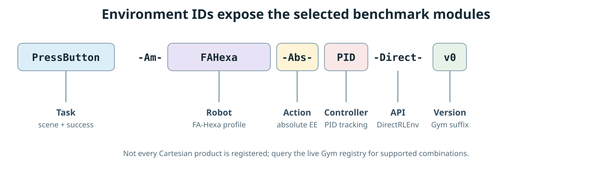
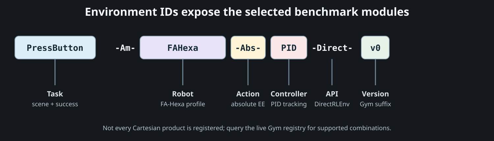

# Environment IDs

AM-Bench registers Isaac Lab direct environments with IDs that expose the task, robot profile, action interface, and controller selection.

<div class="amb-theme-figure" markdown>

{ .amb-theme-figure__light }
{ .amb-theme-figure__dark aria-hidden="true" }

</div>

## Naming pattern

```text
<Task>-Am-<Robot>-<Action>-<Controller>-Direct-v0
```

The BaseJoint interface adds one token:

```text
<Task>-Am-<Robot>-BaseJoint-Abs-<Controller>-Direct-v0
```

| Segment | Values used by the maintained suite | Meaning |
| --- | --- | --- |
| `Task` | `PressButton`, `PegInHole`, `FrameAssembly`, and the other names in [Tasks and Scenes](../configure/tasks-and-scenes.md) | Task family and scene logic |
| `Robot` | `EE`, `UAQuad`, `UAHexa`, `FAHexa`, `OmniHexa` | EE oracle, UA-Quad, UA-Hexa, FA-Hexa, or Omni-Hexa profile |
| `Action` | `Abs` or `BaseJoint-Abs` | Public action representation |
| `Controller` | `PID`, `L1`, or `MPC` | Low-level controller family |
| `Direct` | fixed token | Isaac Lab `DirectRLEnv` task |
| `v0` | version suffix | Gym registration version |

Not every combination is registered. BaseJoint variants exist only for selected tasks and platforms, and whole-body MPC uses absolute EE targets on `FAHexa`. Treat the Gym registry as authoritative.

## Discover the exact registry

Follow [Find an Environment](../getting-started/find-an-environment.md) to launch the registry command and select an ID from the current checkout. This reference explains the returned IDs; the live Gym registry remains authoritative.

## Maintained registration inventory

The 12 maintained public task prefixes are:

```text
CabinetPickPlace  FrameAssembly   LemonHarvesting  NDT
OpenDoor          PegInHole       PressButton      PullLever
PushSlider        RotateValve     TossBall         WipeWindow
```

Every task prefix is registered with these 8 suffixes:

| Robot | Registered suffixes |
| --- | --- |
| EE oracle | `-Am-EE-Abs-PID-Direct-v0`, `-Am-EE-Abs-L1-Direct-v0` |
| OmniHexa | `-Am-OmniHexa-Abs-PID-Direct-v0` |
| FAHexa | `-Am-FAHexa-Abs-PID-Direct-v0`, `-Am-FAHexa-Abs-L1-Direct-v0`, `-Am-FAHexa-Abs-MPC-Direct-v0` |
| UAHexa | `-Am-UAHexa-Abs-PID-Direct-v0` |
| UAQuad | `-Am-UAQuad-Abs-PID-Direct-v0` |

Concatenate one task prefix and one suffix from the same row set. For example, `WipeWindow` plus `-Am-UAQuad-Abs-PID-Direct-v0` gives the registered ID `WipeWindow-Am-UAQuad-Abs-PID-Direct-v0`.

Selected tasks add these variants:

| Tasks | Additional suffixes |
| --- | --- |
| `PressButton`, `PushSlider`, `RotateValve` | `-Am-FAHexa-BaseJoint-Abs-PID-Direct-v0`, `-Am-FAHexa-BaseJoint-Abs-L1-Direct-v0` |
| `LemonHarvesting`, `PressButton`, `PushSlider`, `RotateValve` | `-Am-EE-Abs-PID-Direct-Fast-v0` |

This produces 106 maintained public IDs. The inventory is derived from the literal `task_id` registrations in the 12 maintained task packages. Development-only task packages are outside this public inventory.

## Examples

```text
PressButton-Am-EE-Abs-PID-Direct-v0
PressButton-Am-FAHexa-Abs-PID-Direct-v0
PressButton-Am-FAHexa-BaseJoint-Abs-L1-Direct-v0
PressButton-Am-FAHexa-Abs-MPC-Direct-v0
```

The first is the lightest task-logic check. The second adds a physical FA-Hexa, Pyroki IK, allocation, and PID tracking. The third makes the policy command base pose and arm joints directly. The fourth replaces the decoupled IK–tracking path with whole-body MPC.

The `-Fast-v0` registrations are specialized scripted-policy configurations rather than the default starting point.
