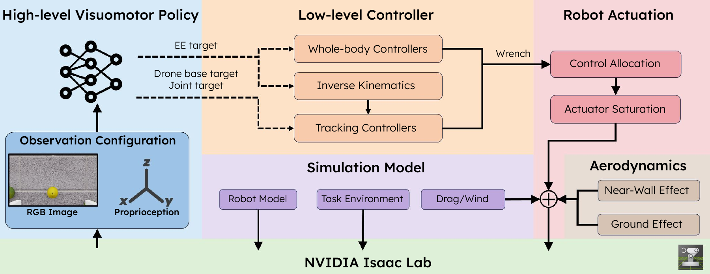

# Benchmark Design

AM-Bench factorizes aerial manipulation into modules that can be changed independently while retaining shared tasks and evaluation outputs.

  

## Five configuration axes

### Task environment

Tasks define scene geometry, manipulated objects, reset randomization, success conditions, subtasks, and episode limits. The current suite spans instantaneous interaction, object transport, and constrained-contact skills.

### Robot platform

Robot profiles combine an articulation, rotor layout, manipulator and gripper semantics, camera placement, action pipeline, and controller. The physical platforms cover underactuated, fully actuated, and overactuated multirotors.

### High-level policy

Policies consume configurable RGB and proprioceptive observations. They output either an end-effector target or an absolute base-plus-joint target. Scripted policies and learned policies share the same environment action boundary.

### Low-level control

End-effector targets can pass through decoupled inverse-kinematics and tracking controllers or through whole-body MPC. Base-plus-joint targets bypass inverse kinematics and directly specify the configuration tracked by the low-level controller.

### Physics and actuation

Control allocation maps body wrench commands to rotor thrusts. The simulation can apply physical saturation, reduced-order actuator response, ground effect, near-wall effect, drag, wind, and sensor or command noise.

## Controlled comparisons

The modular split supports comparisons that would otherwise conflate multiple causes. For example, the same task and learned policy can be evaluated with different low-level controllers, or the same end-effector command can be resolved on multiple embodiments. Tracking and limit-use metrics help explain why two runs with similar task success may use the platform differently.

Use [Policy-Control Interfaces](interfaces.md) for the command paths, [Physics and Disturbances](physics.md) for force application order, and [Evaluation Outputs](../reference/evaluation.md) for the recorded diagnostics.
