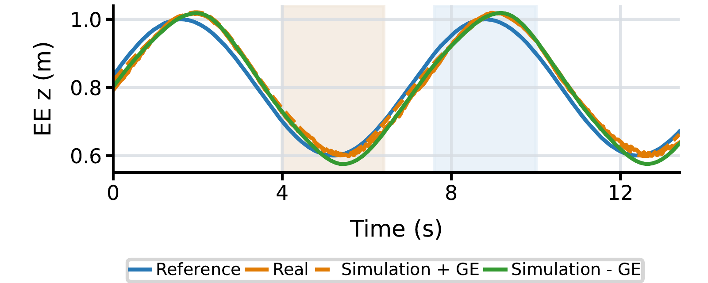
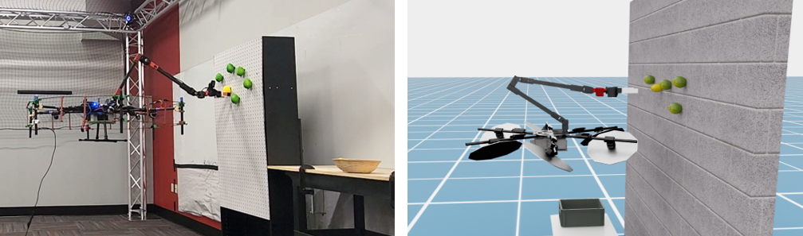

# Experimental Findings

This page summarizes the experiments reported in the current AM-Bench paper revision. It is a fixed research snapshot, not a live leaderboard. Reproduce comparisons with the paper's task set, checkpoints, seeds, rollout counts, interfaces, and controller settings before comparing new numbers.

## High-level visuomotor policies

The paper evaluates ACT, Diffusion Policy, PI0, and PI0.5 on FA-Hexa through the EE-target IK–PID interface. Each task uses 80 successful scripted demonstrations, and each reported method is evaluated for 30 rollouts on each of the 12 tasks.

| Policy | Macro success rate | Macro subtask completion |
| --- | ---: | ---: |
| ACT | 26.94% | 34.17% |
| Diffusion Policy | 41.39% | 53.52% |
| PI0 zero-shot | 8.61% | 8.95% |
| PI0 multi-task fine-tuned | 36.67% | 54.63% |
| PI0 multi-task then single-task fine-tuned | 45.00% | 59.04% |
| PI0.5 zero-shot | 2.78% | 6.30% |
| PI0.5 multi-task fine-tuned | 49.17% | 59.44% |
| PI0.5 multi-task then single-task fine-tuned | **52.22%** | **67.31%** |

The reported results show a substantial aerial-manipulation domain gap for zero-shot VLAs. Multi-task domain adaptation accounts for most of the fine-tuning gain, while subsequent task-specific specialization adds a smaller macro-average improvement. Specialist ACT and DP baselines remain competitive on some tasks.

## Data scaling

Task-specific DP policies trained with 10, 20, 40, and 80 demonstrations per task achieved macro success rates of 20.6%, 36.7%, 39.2%, and 45.6% in the paper experiment. The largest aggregate gain occurred from 10 to 20 demonstrations; later changes were smaller and individual tasks were not always monotonic.

## Policy-control interface

The paper's representative ablation found that EE-target policies generally achieved higher task success and used less tilt and saturation than policies that directly commanded base pose and arm joints. Whole-body MPC achieved the strongest success in the reported Press Button and Push Slider DP comparisons, illustrating that policy and control design should be evaluated together rather than treated as independent modules.

## Hardware evidence

For a shared vertical end-effector reference, enabling the ground-effect model reduced near-ground simulation-to-real EE-height RMSE from 1.91 cm to 0.99 cm in the tested interval. At higher altitude, the with- and without-ground-effect errors were comparable.

The paper also instantiates the demonstration collection, DP training, and EE-command deployment pipeline on a physical FA-Hexa for lemon harvesting.

## Scope of the evidence

These studies demonstrate how the suite isolates policy, interface, controller, embodiment, and physical-model choices. They are not exhaustive conclusions across every aerial manipulator or operating condition. Use [Evaluation Outputs](../reference/evaluation.md) to retain the diagnostics needed for a new controlled comparison.
