# Task Suite

The current paper and repository define 12 representative aerial manipulation tasks. They are grouped by the interaction structure that the policy and controller must handle.

## Task summary

| Category | Task | Terminal success | Intermediate progress |
| --- | --- | --- | --- |
| Instantaneous interaction | Press Button | button joint passes the pressed threshold | none |
| Instantaneous interaction | Peg-in-Hole | peg penetrates the opening within lateral bounds | none |
| Object transport | Frame Assembly | frame is aligned and placed on all pegs | lifted; placed |
| Object transport | Cabinet Pick-and-Place | can is placed stably on the drawer | door opened; can lifted; placed |
| Object transport | Lemon Harvesting | lemon is released inside the container | grasped/detached; delivered/released |
| Object transport | Toss Ball | released ball lands in the container under the base-position constraint | released; delivered |
| Articulated or constrained contact | Rotate Valve | shaft reaches the target rotation | engaged; rotated |
| Articulated or constrained contact | Push Slider | slider reaches its rail target | engaged; pushed |
| Articulated or constrained contact | Pull Lever | lever exceeds its target angular displacement | engaged; pulled |
| Articulated or constrained contact | Open Door | hinge exceeds the open threshold | engaged; opened |
| Articulated or constrained contact | Wipe Window | all stains are removed under contact constraints | per-stain removal |
| Articulated or constrained contact | NDT | stable contact is maintained at the inspection region | none |

The registered environment family for each task contains multiple robot, action, and controller variants. Run `python scripts/environments/list_envs.py` for the authoritative current list.

## Instantaneous interaction

### Press Button

The end effector must approach a randomized button and drive its prismatic joint past the success threshold. Randomization includes wall pose and texture plus button pose, size, and color.

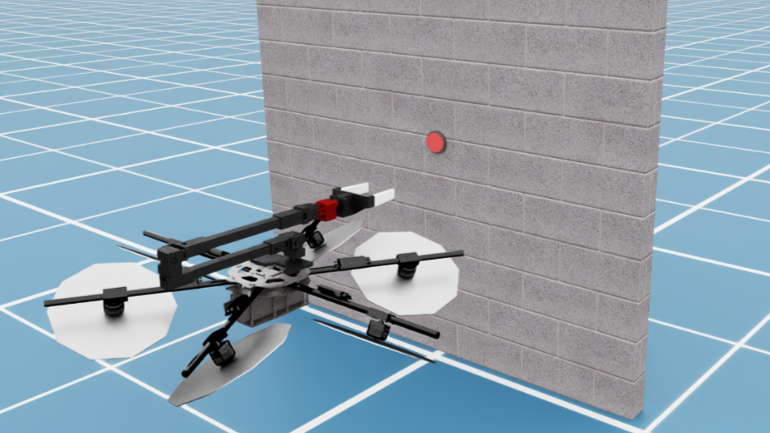
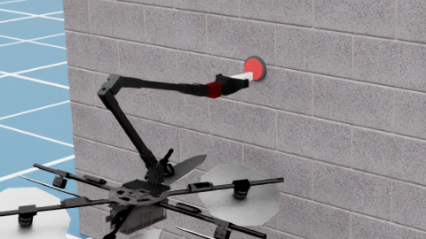

### Peg-in-Hole

The peg tip must pass the wall surface while remaining inside the hole's lateral bounds. Wall and hole geometry, pose, texture, size, and color can vary.

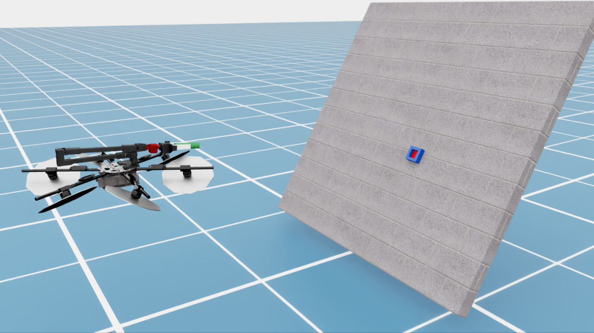
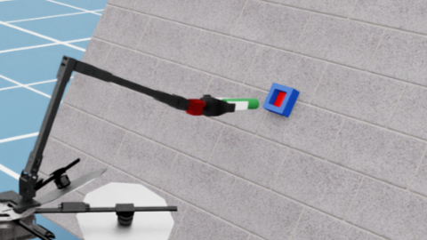

## Object transport

### Frame Assembly

The robot lifts a frame, aligns it with a multi-peg fixture, and places it onto the pegs. Frame and peg initial poses are randomized.

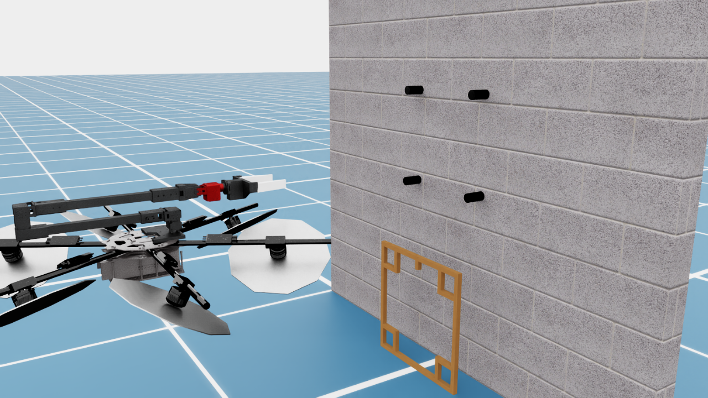
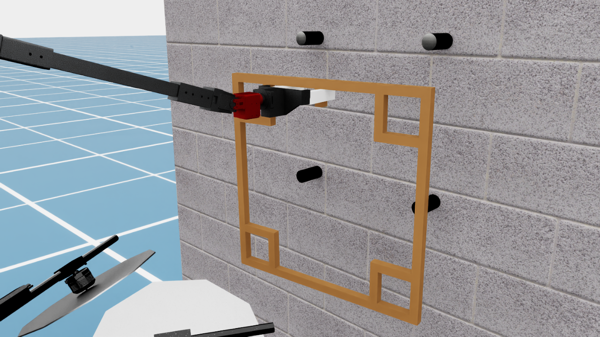

### Cabinet Pick-and-Place

The robot opens a cabinet door, lifts a can, and places the can stably on the drawer. Object pose, door friction, and payload mass can vary.

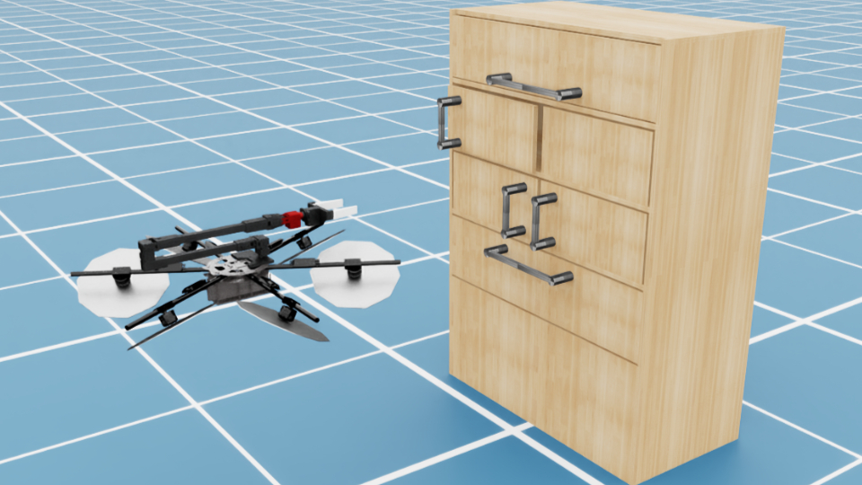
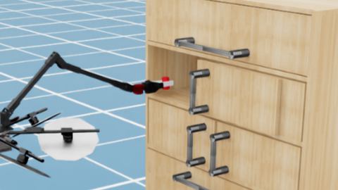

### Lemon Harvesting

The robot grasps and detaches a lemon, transports it, and releases it into a container. Wall appearance and fruit locations are randomized.

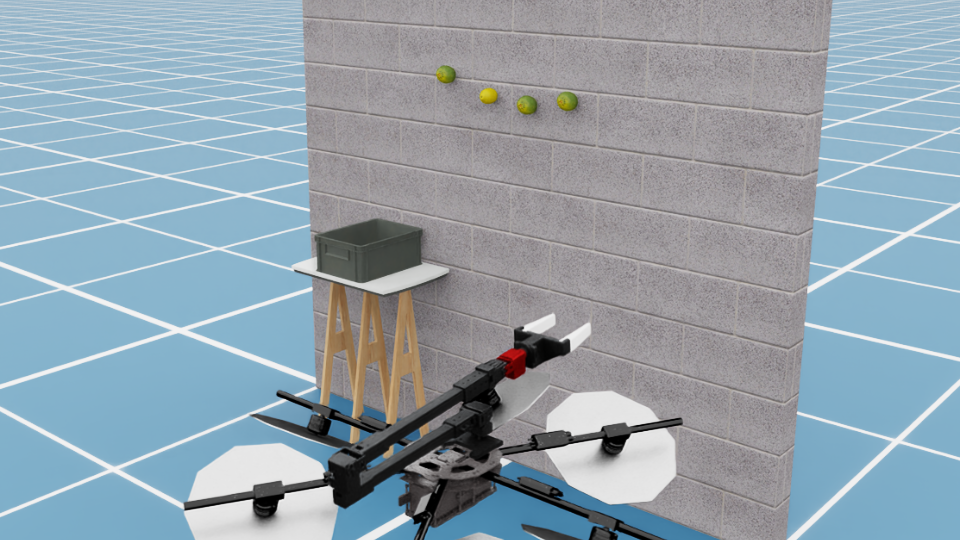
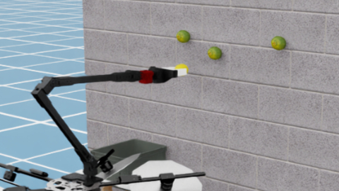

### Toss Ball

The robot must release a ball with sufficient momentum to reach a container while respecting a base-position constraint. This is the suite's explicitly dynamic transport task.

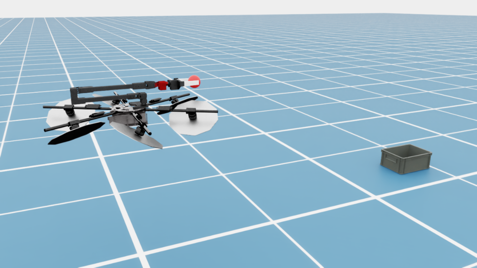
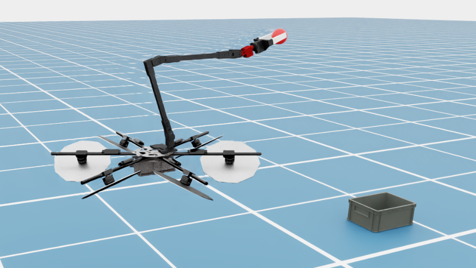

## Articulated objects and constrained contact

### Rotate Valve

The end effector engages a valve and rotates its shaft to the target. Wall and valve pose, texture, friction, and color can vary.

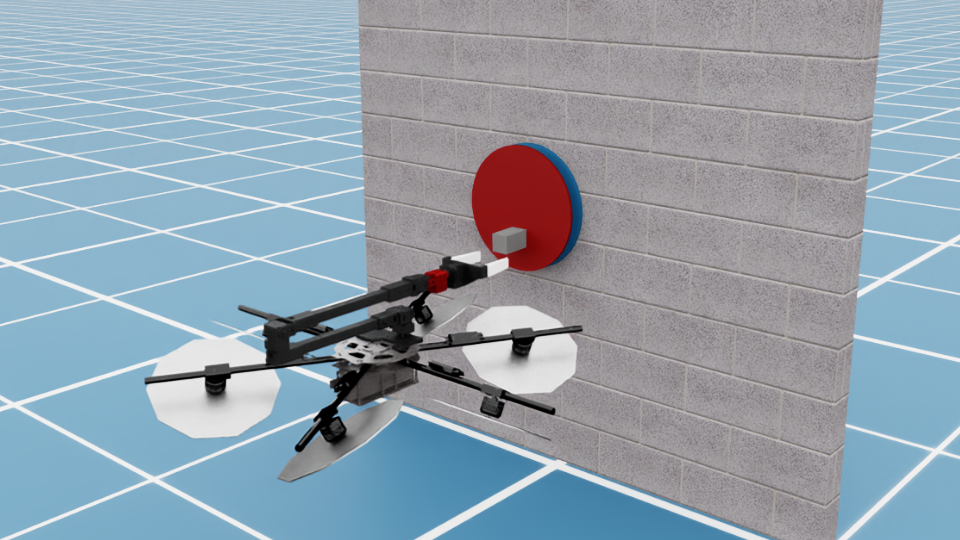
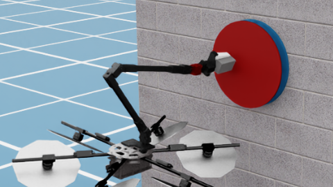

### Push Slider

The end effector engages a slider and pushes its prismatic joint along a rail. Slider pose, friction, color, and surrounding wall conditions can vary.

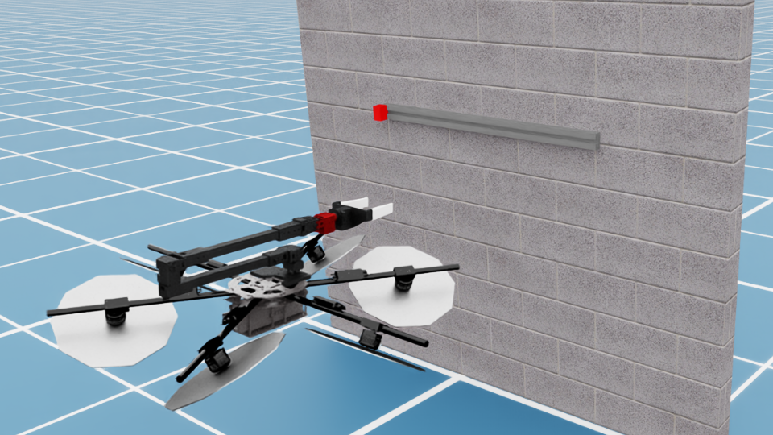
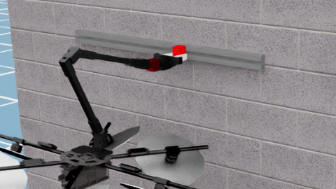

### Pull Lever

The robot engages a lever and pulls it through a target angular range while rejecting the reaction wrench.

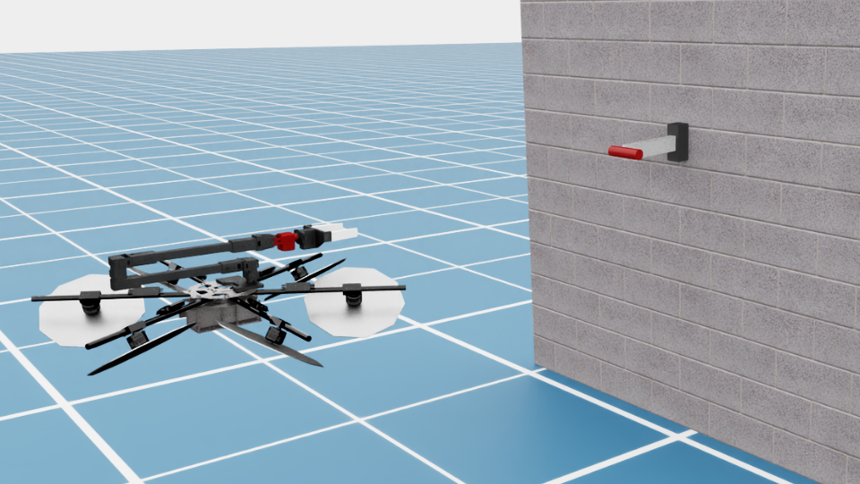
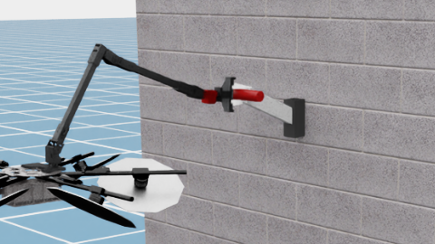

### Open Door

The end effector engages a door and drives the hinge past the open threshold. Door pose, texture, and hinge damping can be randomized.

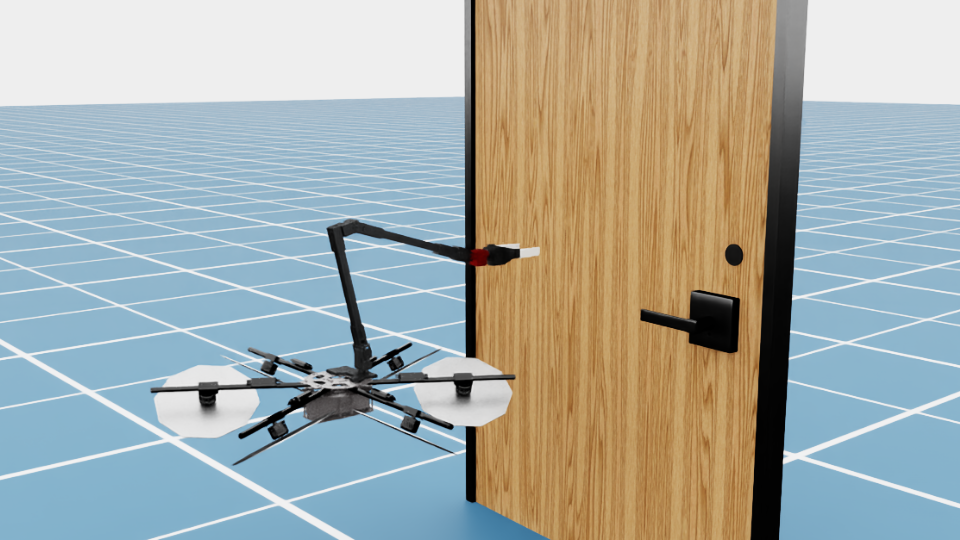
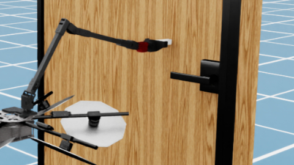

### Wipe Window

The robot removes stains by maintaining sufficient force and proximity while following the surface. Window pose, stain locations, and friction can vary.

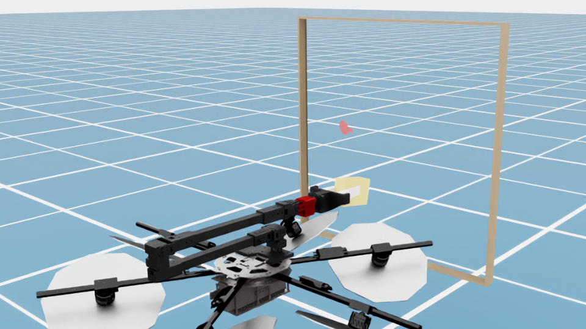
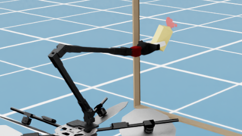

### NDT

The non-destructive-testing task requires stable contact at a randomized inspection point on a building surface for a fixed duration.

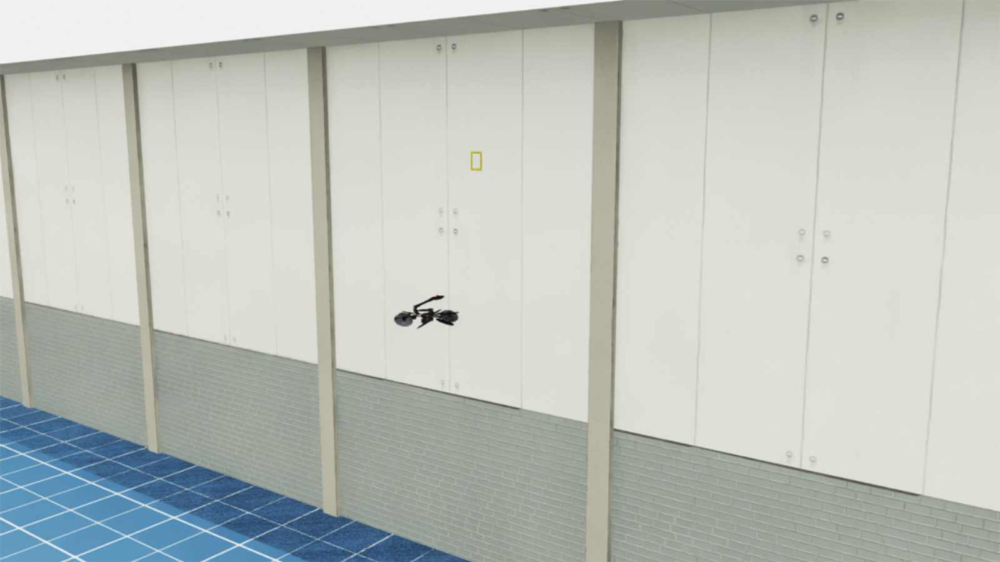
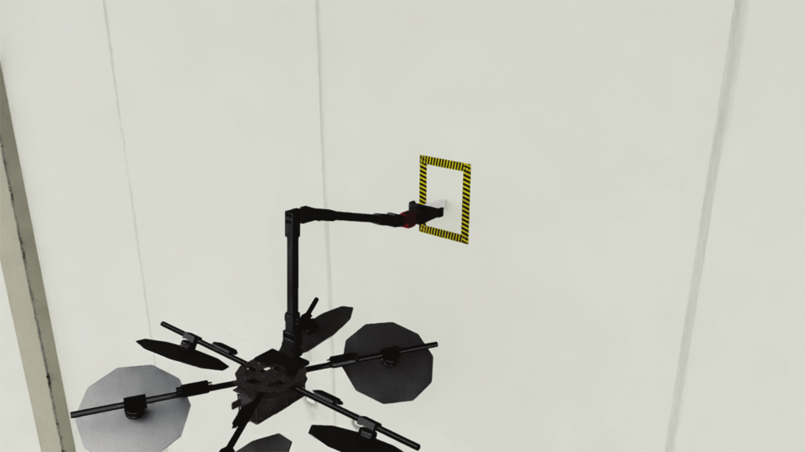

## Randomization and comparability

Task configs expose task-specific randomization rather than one global difficulty switch. When comparing policies or controllers, record the task ID, seed, environment count, episode horizon, disturbance flags, and any config overrides. A result is comparable only when those conditions match.
