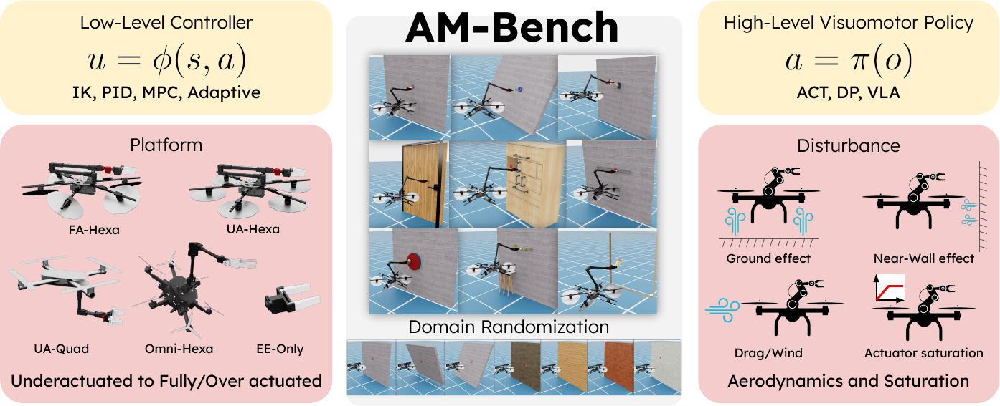

# AM-Bench

**A modular simulation suite and benchmark for aerial manipulation policy learning.**

<div class="amb-hero">
  
</div>

AM-Bench studies aerial manipulation as a system-level problem. A policy does not act in isolation: its behavior depends on the robot embodiment, the action interface, the low-level controller, and the physical effects acting on the platform. The suite makes those choices configurable under shared tasks and evaluation outputs.

<div class="amb-grid">
  <div class="amb-card">
    <h3>12 tasks</h3>
    <p>Instantaneous interaction, object transport, articulated objects, and constrained contact.</p>
    <p><a href="benchmark/tasks/">Explore the task suite →</a></p>
  </div>
  <div class="amb-card">
    <h3>Five embodiments</h3>
    <p>Four multirotor-based platforms spanning underactuated through overactuated designs, plus an EE-only oracle.</p>
    <p><a href="benchmark/robots/">Compare platforms →</a></p>
  </div>
  <div class="amb-card">
    <h3>Common policy boundary</h3>
    <p>Scripted policies, ACT, Diffusion Policy, PI0, and PI0.5 share canonical data and evaluation conventions.</p>
    <p><a href="policies/">Choose a policy →</a></p>
  </div>
  <div class="amb-card">
    <h3>Dynamics-critical evaluation</h3>
    <p>Control allocation, rotor saturation, actuator dynamics, drag, wind, ground effect, and near-wall effect.</p>
    <p><a href="benchmark/physics/">Understand the models →</a></p>
  </div>
</div>

## Start with one working environment

Install AM-Bench beside an Isaac Lab checkout, activate the Isaac Lab Python environment, and list the registered environments:

```bash
source ../IsaacLab/env_isaaclab/bin/activate
uv pip install -e source/am_isaac
uv pip install -e source/am_isaac_il
python scripts/environments/list_envs.py
```

Continue with [Installation](getting-started/installation.md) for prerequisites and optional controller dependencies, then run the bounded check in [First Simulation](getting-started/first-run.md).

## What the benchmark is for

AM-Bench is designed for controlled comparisons across five axes:

1. task environment;
2. robot platform;
3. high-level policy and action interface;
4. low-level control;
5. disturbances, actuator dynamics, and saturation.

It supports questions such as whether an end-effector target is a better policy interface than direct base-plus-joint targets, how controller choice changes policy outcomes, and where an embodiment reaches its physical limits. See [Benchmark Design](benchmark/index.md) for the system decomposition and [Experimental Findings](benchmark/results.md) for the paper snapshot.

## Choose your path

- **Run a task:** [First Simulation](getting-started/first-run.md)
- **Collect data:** [Collect Demonstrations](workflows/collect-demos.md)
- **Train a baseline:** [Policy Guides](policies/index.md)
- **Interpret an environment ID:** [Environment IDs](reference/environments.md)
- **Add a benchmark component:** [Extend AM-Bench](extend/index.md)
- **Cite the project:** [Paper and Citation](project/paper.md)

<div class="amb-note">
AM-Bench currently targets native Linux with an NVIDIA GPU and an Isaac Sim / Isaac Lab installation. Dataset, checkpoint, source-code, and full-benchmark artifact links will be added as their public releases become available.
</div>
