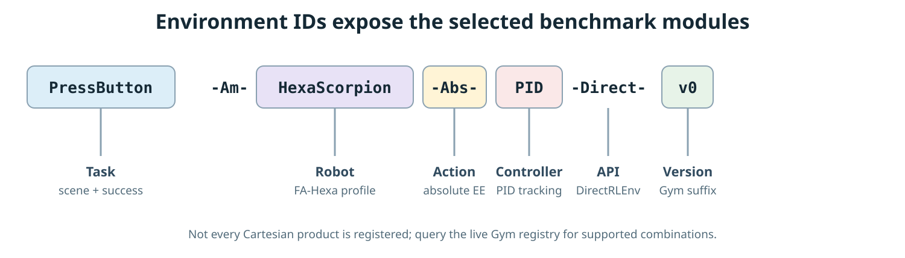

# Environment IDs

AM-Bench registers Isaac Lab direct environments with IDs that expose the task, robot profile, action interface, and controller selection.



## Naming pattern

```text
<Task>-Am-<Robot>-<Action>-<Controller>-Direct-v0
```

The BaseJoint interface adds one token:

```text
<Task>-Am-<Robot>-BaseJoint-Abs-<Controller>-Direct-v0
```

| Segment | Values used by the maintained suite | Meaning |
| --- | --- | --- |
| `Task` | `PressButton`, `PegInHole`, `FrameAssembly`, and the other names in the [Task Suite](../benchmark/tasks.md) | Task family and scene logic |
| `Robot` | `EE`, `QuadScorpion`, `HexaScorpionUAC`, `HexaScorpion`, `OmniScorpion` | EE oracle, UA-Quad, UA-Hexa, FA-Hexa, or Omni-Hexa profile |
| `Action` | `Delta`, `Abs`, or `BaseJoint-Abs` | Public action representation |
| `Controller` | `PID`, `L1`, or `MPC` | Low-level controller family |
| `Direct` | fixed token | Isaac Lab `DirectRLEnv` task |
| `v0` | version suffix | Gym registration version |

Not every combination is registered. BaseJoint variants exist only for selected tasks and platforms, and whole-body MPC uses absolute EE targets on `HexaScorpion`. Treat the Gym registry as authoritative.

## Discover the exact registry

From the repository root:

```bash
source ../IsaacLab/env_isaaclab/bin/activate
python scripts/environments/list_envs.py
```

The command launches Isaac Sim headlessly and prints every registered AM-Bench ID with its environment class and config entry point.

## Examples

```text
PressButton-Am-EE-Delta-PID-Direct-v0
PressButton-Am-HexaScorpion-Abs-PID-Direct-v0
PressButton-Am-HexaScorpion-BaseJoint-Abs-L1-Direct-v0
PressButton-Am-HexaScorpion-Abs-MPC-Direct-v0
```

The first is the lightest task-logic check. The second adds a physical FA-Hexa, Pyroki IK, allocation, and PID tracking. The third makes the policy command base pose and arm joints directly. The fourth replaces the decoupled IK–tracking path with whole-body MPC.

Some task families also register `-Fast-v0` research variants. They are specialized scripted-policy configurations rather than the default starting point.

