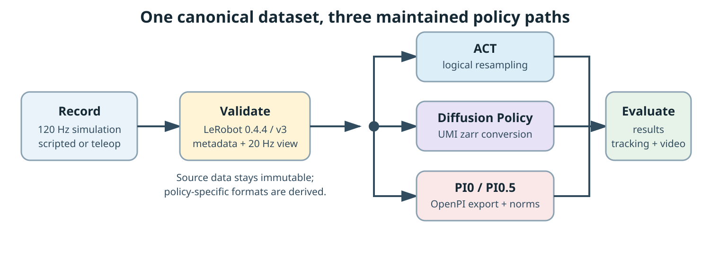

# Workflows

AM-Bench uses one canonical recording boundary and derives policy-specific formats only after validation.

## Supported path

1. Record successful demonstrations at the environment rate into a finalized LeRobot dataset.
2. Validate metadata, episode boundaries, feature shapes, samples, action semantics, and the intended logical policy rate.
3. Keep the canonical source immutable.
4. Train ACT directly from the logical dataset view, convert to UMI zarr for DP, or export the pinned OpenPI layout for PI0/PI0.5.
5. Evaluate through the policy-family entrypoint and retain common result, tracking, and video artifacts.

## Workflow pages

- [Collect Demonstrations](collect-demos.md) covers scripted and teleoperated recording.
- [Validate Datasets](validate-data.md) defines the required source-data gate.
- [Train and Evaluate](train-evaluate.md) explains shared policy conventions and artifact outputs.
- [Policy Guides](../policies/index.md) provide family-specific installation and commands.

The canonical dataset is the source of truth. Zarr stores, OpenPI exports, normalization statistics, and checkpoints are derived artifacts and should be reproducible from the source dataset plus an explicit configuration.
